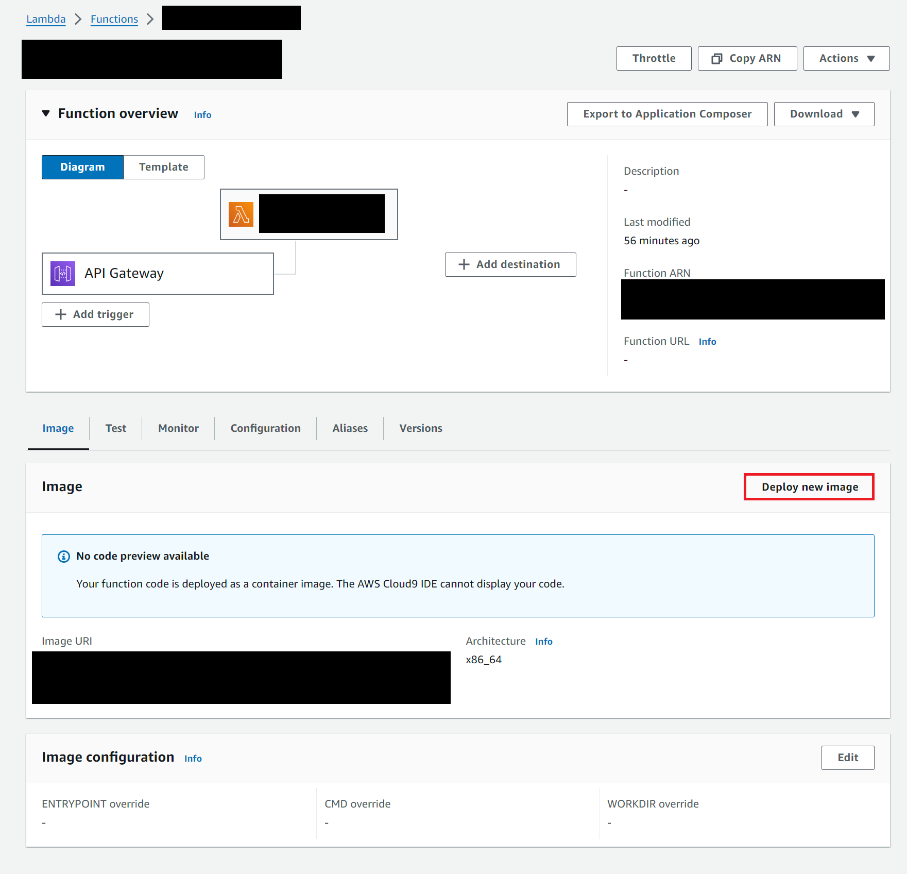
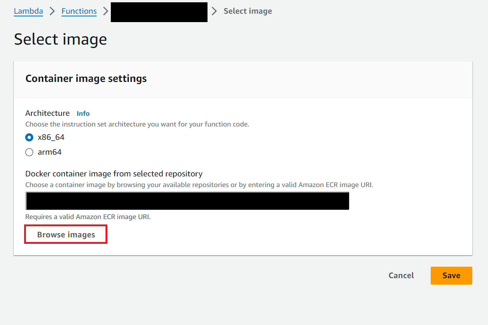
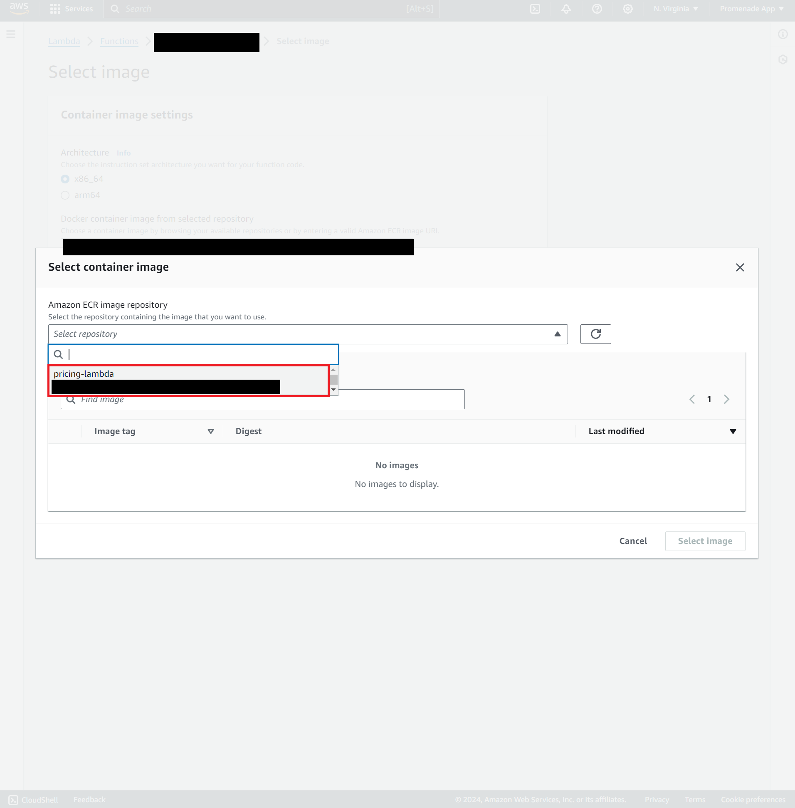
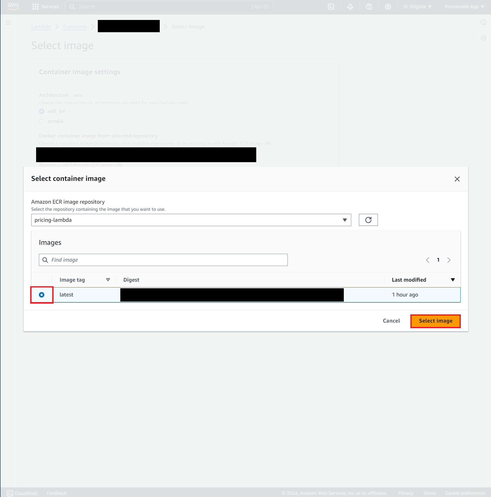

# Pickup Selection

## Note: TomTom API Key

Testing this locally requires a TomTom API Key.

Create a file called `.env` and inside the file, add the following line:

```bash
TOMTOM_API_KEY=<your_api_key>
```

## Required Environment Variables

For this project, you will need a `.env` file to run locally.

### Sample `.env` file:
```
TOMTOM_API_KEY=<...>
ORS_API_KEY=<...>
PRICING_API_URL=<...>
TOMTOM_API_URL=https://api.tomtom.com/routing/1/batch/sync/json?key=
CACHE_URL=<your local IP -- not localhost>:11211
TT_TTL=300
MEMCACHED_USERNAME=<...>
MEMCACHED_PASSWORD=<...>
```

### Variables:
+ `TOMTOM_API_KEY` - self-explanatory, your API key for the TomTom API (used for timing/measuring drives and traffic). You may wish to have separate keys for production (on AWS) and development (here) if you need to keep your production free-tier quota open while also developing the app.
+ `ORS_API_KEY` - your API key for the OpenRouteService API (used for timing/measuring walks).
+ `PRICING_API_URL` - EITHER the URL for the hosted `price_prediction_go` AWS Lambda function OR the URL to your local `price_prediction_go` Lambda docker.
+ `TOMTOM_API_URL` - this should stay as `https://api.tomtom.com/routing/1/batch/sync/json?key=`.
+ `CACHE_URL` - EITHER the URL of your hosted memcached instance OR the URL of your local memcached instance `<your local IP>:11211` started by `scripts/start_memcached.sh`.
+ `TT_TTL` - the Time-to-Live of the TomTom data stored in the cache. the value we used was 300sec (5min).
+ `MEMCACHED_USERNAME` and `MEMCACHED_PASSWORD` - if using the local memcached instance, this SETS the login for the created container AND uses it to connect. if using a hosted instance, this is the login to that instance.

## How to Install onto AWS

### Step 1. Log into AWS ECR

Run this command, replacing `<ecr_url>` with the ECR URL for the project (will be in Discord):

```bash
aws ecr get-login-password --region us-east-1 | docker login --username AWS --password-stdin <ecr_url>
```

### Step 2a. Build the Docker container (and run it) locally

You must either be on Mac/Linux OR using WSL to run this.

This will take a long time when you build it for the first time, however subsequent builds should be much faster.

```bash
./scripts/rebuild.sh
```

Next, open up your favorite REST API testing tool such as Postman.

To make a request to the API, the URL will be

```
http://localhost:8080/2015-03-31/functions/function/invocations
```

and you will send a POST request with an application/json body containing the data.

**ALSO**

You can test automatically with:

```bash
./scripts/invoke.sh tests/eaba.json
```

for example.

### Step 3. Tag the Docker container for upload on ECR

```bash
docker tag pickup-selection <ecr_url>/pickup-selection:latest
```

### Step 4. Upload to ECR

```bash
docker push <ecr_url>/pickup-selection:latest
```

### Step 5. Update the Lambda image

Deploy the new image:



Browse for the image:



Select our ECR repository:



Now select the **latest** copy of the image:



Finally click **Save**.

### Step 6. Delete the old image

Please do this so we don't pay extra for storage!!

Go to the ECR page and select our repository.

Find the image without a **latest** tag and delete it.

> Image pending...

## Calling from AWS Lambda

This container expects a location in JSON form:

```json
{
  "source": {
    "lat": 41.795974,
    "long": -111.90551
  },
  "destination": {
    "lat": 41.75424,
    "long": -111.79385
  },
  "maxPoints": 4
}
```

and returns data of the form:

```json
{
    "rides": [
        {
            "source": {  // Snapped to a valid road
                "lat": 41.794773873175366,
                "long": -111.89596231756263
            },
            "pickupPoint": {  // The pickup point in question for this ride
                "lat": 41.795974,
                "long": -111.90551
            },
            "destination": {  // Snapped to a valid road
                "lat": 41.75424,
                "long": -111.79385
            },
            "walkTime": 705,  // (in sec)
            "walkDistance": 0.608322209,  // (in mi)
            "driveTime": 864,  // (in sec)
            "driveDistance": 7.440296354,  // (in mi)
            "totalTime": 1569,  // (in sec)
            "totalDistance": 8.048618563,  // (in mi)
            "price": 17.9,  // Predicted price of this ride
            "savings": 5.291005291005291  // Savings versus not walking at all (in %)
        },
        {
            "source": {
                "lat": 41.79474331724166,
                "long": -111.90448799718602
            },
            "pickupPoint": {
                "lat": 41.795974,
                "long": -111.90551
            },
            "destination": {
                "lat": 41.75424,
                "long": -111.79385
            },
            "walkTime": 196,
            "walkDistance": 0.169634283,
            "driveTime": 898,
            "driveDistance": 7.880848393,
            "totalTime": 1094,
            "totalDistance": 8.050482676,
            "price": 17.9,
            "savings": 5.291005291005291
        },
        // ...
    ]
}
```

Note the `maxPoints` feature was never implemented server-side, and the frontend is what will actually trim the amount of points.