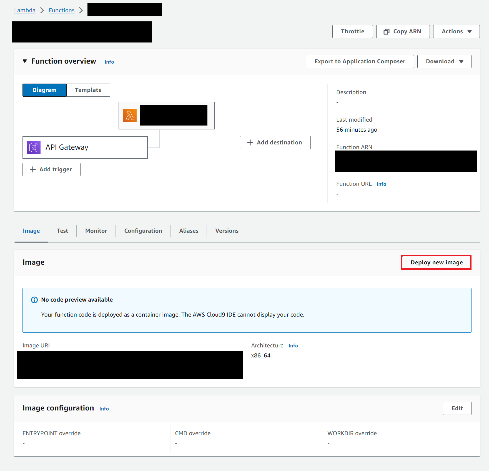
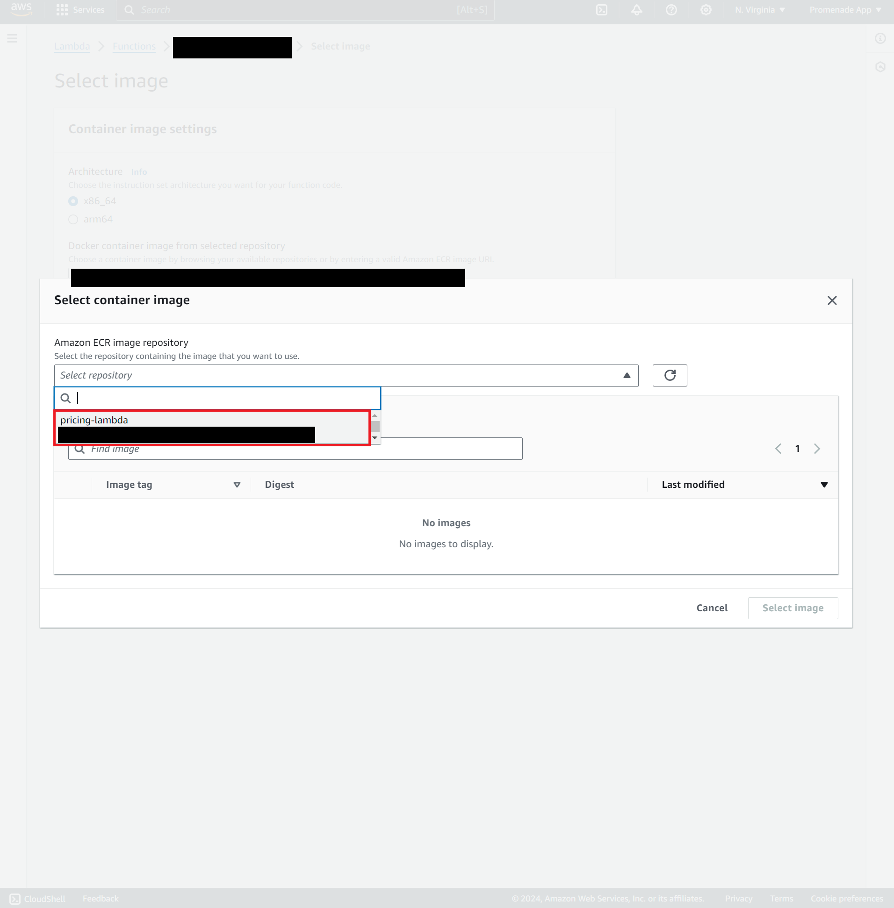
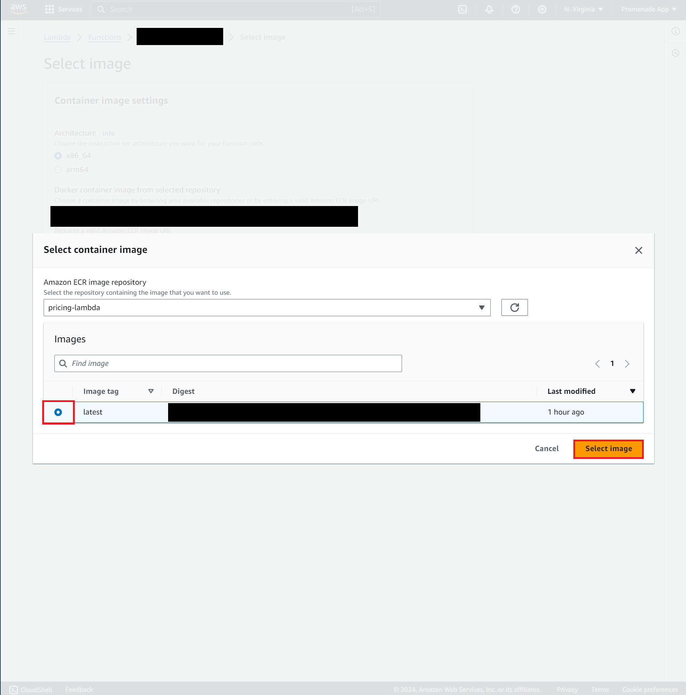

# Uber Price Prediction (with TensorFlow Go)

## How to Install onto AWS

### Step 1. Log into AWS ECR

Run this command, replacing `<ecr_url>` with the ECR URL for the project (will be in Discord):
```bash
aws ecr get-login-password --region us-east-1 | docker login --username AWS --password-stdin <ecr_url>
```

### Step 2a. Build the Docker container (and run it) locally

You must either be on Mac/Linux OR using WSL to run this.

This will take a long time when you build it for the first time, however subsequent builds should be much faster.
```bash
./scripts/rebuild.sh
```

Next, open up your favorite REST API testing tool such as Postman.

To make a request to the API, the URL will be 
```
http://localhost:8080/2015-03-31/functions/function/invocations
```

and you will send a POST request with an application/json body containing the data.

**ALSO**

You can test automatically with:

```bash
./scripts/invoke.sh tests/basic.json
```

for example.

### Step 3. Tag the Docker container for upload on ECR

```bash
docker tag price-prediction-go <ecr_url>/price-prediction-go:latest
```

### Step 4. Upload to ECR

```bash
docker push <ecr_url>/price-prediction-go:latest
```

### Step 5. Update the Lambda image

Deploy the new image:



Browse for the image:


Select our ECR repository:



Now select the **latest** copy of the image:



Finally click **Save**.

### Step 6. Delete the old image

Please do this so we don't pay extra for storage!!

Go to the ECR page and select our repository.

Find the image without a **latest** tag and delete it.

> Image pending...

## Calling from AWS Lambda

This container expects (mile, minute) pairs in JSON form:

```json
{
    "miles": [
        0.5, 1.0, 2.0, 2.5, 4.0
    ],
    "minutes": [
        2.0, 4.0, 8.0, 23.5, 16.75
    ]
}
```

and returns data of the form:

```json
{
    "prices": [
        9.482263565063477,
        10.340690612792969,
        13.169022560119629,
        21.532272338867188,
        18.78050994873047
    ]
}
```