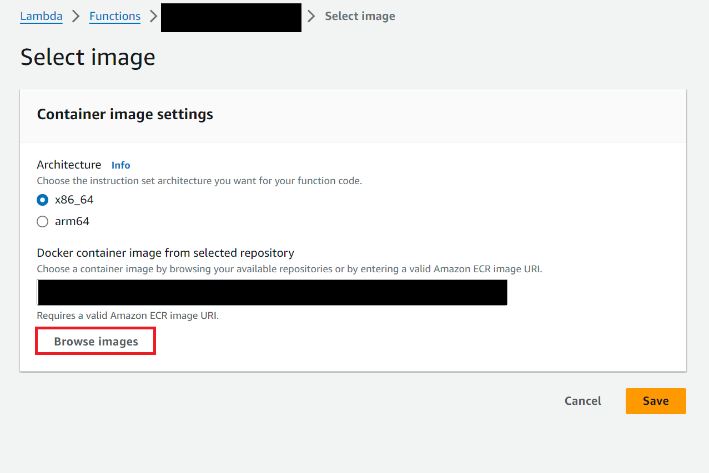

# Uber Price Prediction (with TensorFlow Go)

## How to Install onto AWS

### Step 1. Log into AWS ECR

Run this command, replacing `<ecr_url>` with the ECR URL for the project (will be in Discord):
```bash
aws ecr get-login-password --region us-east-1 | docker login --username AWS --password-stdin <ecr_url>
```

### Step 2a. Build the Docker container (and run it) locally

You must either be on Mac/Linux OR using WSL to run this.

This will take a long time when you build it for the first time, however subsequent builds should be much faster.
```bash
./scripts/rebuild.sh
```

Next, open up your favorite REST API testing tool such as Postman.

To make a request to the API, the URL will be 
```
http://localhost:8080/2015-03-31/functions/function/invocations
```

and you will send a POST request with an application/json body containing the data.

**ALSO**

You can test automatically with:

```bash
./scripts/invoke.sh tests/basic.json
```

for example.

### Step 3. Tag the Docker container for upload on ECR

```bash
docker tag price-prediction-go <ecr_url>/price-prediction-go:latest
```

### Step 4. Upload to ECR

```bash
docker push <ecr_url>/price-prediction-go:latest
```

### Step 5. Update the Lambda image

Deploy the new image:


Browse for the image:



Select our ECR repository:


Now select the **latest** copy of the image:


Finally click **Save**.

### Step 6. Delete the old image

Please do this so we don't pay extra for storage!!

Go to the ECR page and select our repository.

Find the image without a **latest** tag and delete it.

> Image pending...

## Calling from AWS Lambda

This container expects an Nx8 array of data in JSON
1. time in seconds
2. distance in meters
3. time to historic ratio (travelTime / historicTravelTime)
4. time to no traffic ratio (travelTime / noTrafficTravelTime)
5. day-of-week (scaled cosine)
6. day-of-week (scaled sine)
7. time-of-day (scaled cosine)
8. time-of-day (scaled sine)
```json
{
    "data": [
        [10, 9, 8, 7, 6, 5, 4, 3],
        [3, 4, 5, 6, 7, 8, 9, 10],
    ]
}
```

and returns data of the form:

```json
{
    "prices": [
        9.482263565063477,
        10.340690612792969,
    ]
}
```

## Debugging

When using a saved ML model, the input operation may have been renamed from the typical ("serving_default_inputs", 0).  
In order to see what the layer names are inside the saved ML model, use the `saved_model_cli`.  
Follow this tutorial from TensorFlow: (https://www.tensorflow.org/guide/saved_model#details_of_the_savedmodel_command_line_interface).
  
Use this command to find the correct input op:
```bash
saved_model_cli show --dir tf_model/ --tag_set serve --signature_def serving_default
```

For example, the response may look like:
```py
The given SavedModel SignatureDef contains the following input(s):
  inputs['inputs'] tensor_info:
      dtype: DT_FLOAT
      shape: (-1, 8)
      name: serving_default_inputs:0
The given SavedModel SignatureDef contains the following output(s):
  outputs['output_0'] tensor_info:
      dtype: DT_FLOAT
      shape: (-1, 1)
      name: StatefulPartitionedCall:0
Method name is: tensorflow/serving/predict
```

In this case, the input being `serving_default_inputs:0` means that in `main.go`:
```go
// Run model
results := model.Exec([]tf.Output{
    model.Op("StatefulPartitionedCall", 0),
}, map[tf.Output]*tf.Tensor{
    model.Op("serving_default_inputs", 0): input,
})
```
the input should be `model.Op("serving_default_inputs", 0)` where 0 is the number after the `:` in `serving_default_inputs:0`

## Upgrading TensorFlow

In the event you need to upgrade TensorFlow, update the dockerfile and replace all references to the libtensorflow, such as:
```docker
RUN wget https://storage.googleapis.com/tensorflow/libtensorflow/libtensorflow-cpu-linux-x86_64-2.15.0.tar.gz
# ...
RUN tar -C ./tf -xzf libtensorflow-cpu-linux-x86_64-2.15.0.tar.gz
RUN tar -C /usr/local -xzf libtensorflow-cpu-linux-x86_64-2.15.0.tar.gz
```

with the version of your choosing:
```docker
RUN wget https://storage.googleapis.com/tensorflow/libtensorflow/libtensorflow-cpu-linux-x86_64-<version>.tar.gz
# ...
RUN tar -C ./tf -xzf libtensorflow-cpu-linux-x86_64-<version>.tar.gz
RUN tar -C /usr/local -xzf libtensorflow-cpu-linux-x86_64-<version>.tar.gz
```